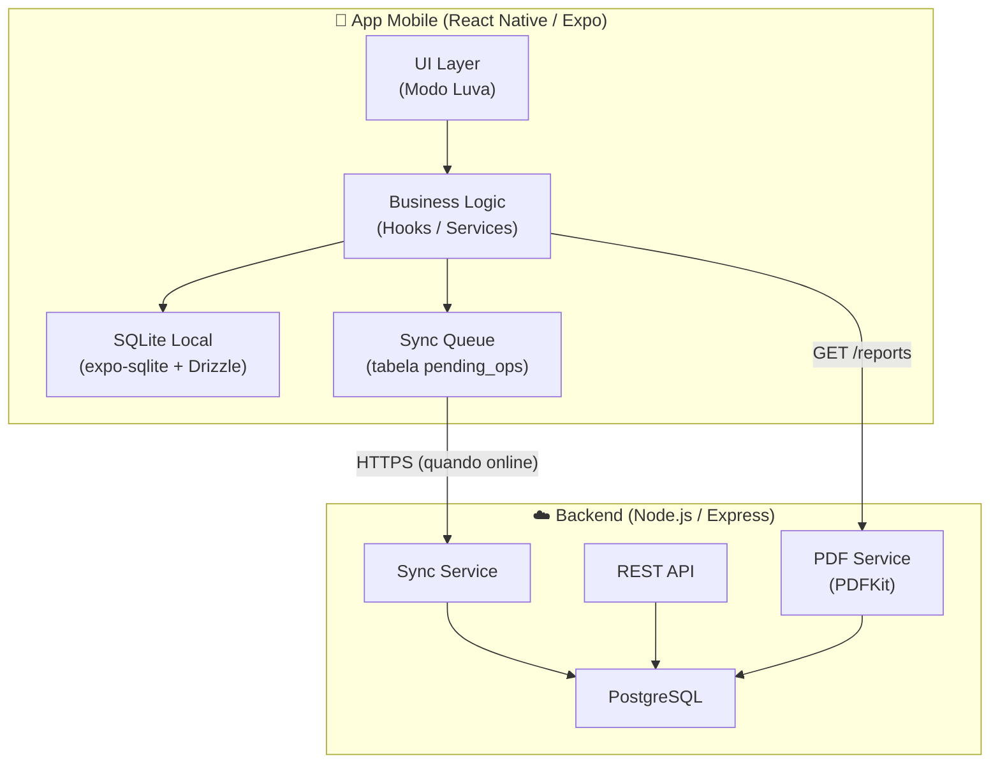
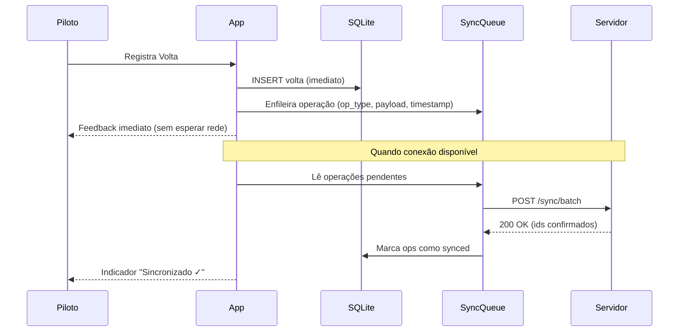
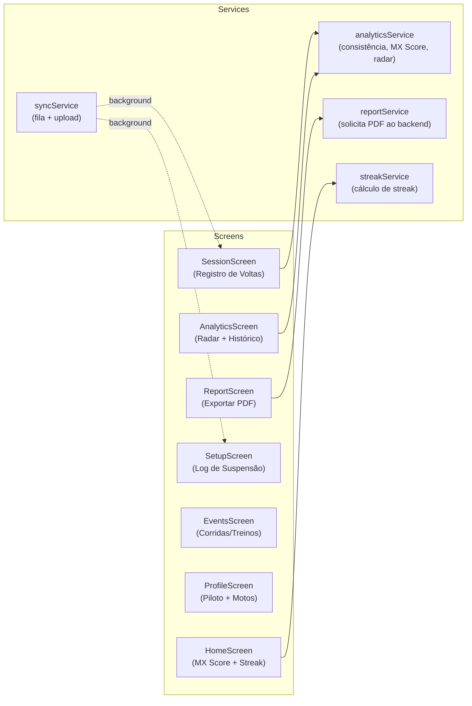
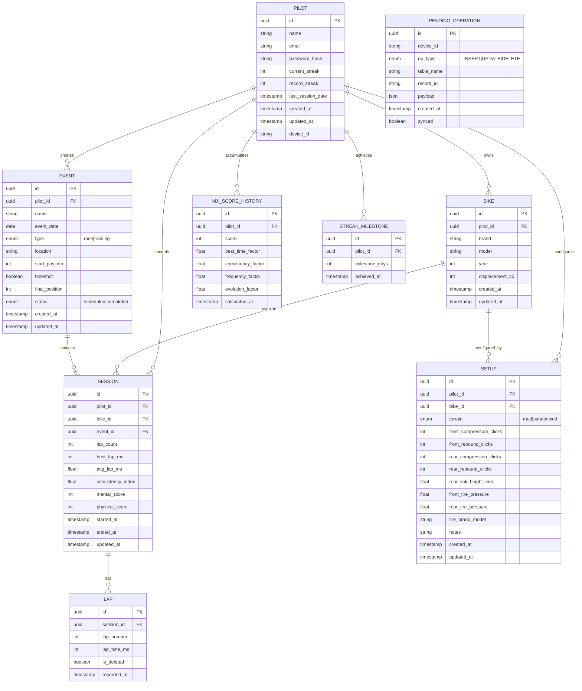

# Design Document — MenteMX Pro

## Overview

O MenteMX Pro é uma plataforma de inteligência esportiva e programa mental para pilotos e atletas do mundo offroad, construída sobre o paradigma **Local-First**: todos os dados são gravados primeiro no dispositivo do piloto e sincronizados com o servidor quando há conectividade. A interface segue o padrão **Modo Luva** — botões de toque mínimo de 56dp, alto contraste WCAG 2.1 AA e no máximo 3 ações primárias por tela.

O MVP cobre três módulos funcionais:

- **Analytics** — Consistência, MX Score e Gráfico de Radar
- **Setup Técnico** — Log de suspensão, pneus e notas por tipo de terreno
- **Eventos** — Corridas e treinos com histórico e métricas consolidadas

Além disso, o sistema inclui **Gamificação** (streaks de treino) e **Exportação de Relatórios** em PDF.

### Decisões de Design Principais

| Decisão | Escolha | Rationale |
|---|---|---|
| Framework mobile | React Native (Expo) | Cross-platform iOS/Android, ecossistema maduro, suporte a SQLite nativo |
| Banco local | SQLite via `expo-sqlite` + Drizzle ORM | Offline-first nativo, queries SQL tipadas, sem dependência de rede |
| Sincronização | Fila de operações com timestamp + Last-Write-Wins | Simples, determinístico, adequado para dados de um único piloto |
| Backend | Node.js + Express + PostgreSQL | Stack familiar, JSON nativo, escalável |
| Gráfico de Radar | `@salmonco/react-native-radar-chart` (SVG) | Leve, sem dependência nativa, customizável |
| Geração de PDF | PDFKit (Node.js, server-side) | Maturidade, suporte a imagens/gráficos, sem binários nativos no mobile |
| Testes de propriedade | `fast-check` + Vitest | Integração nativa TypeScript, shrinking automático, sem configuração extra |

---

## Architecture

O sistema segue uma arquitetura em três camadas com sincronização assíncrona:



### Fluxo Local-First



### Resolução de Conflitos

A estratégia adotada é **Last-Write-Wins (LWW)** baseada em `updated_at` (timestamp ISO 8601 com milissegundos). Cada registro carrega um `device_id` para rastreabilidade. Quando o servidor detecta que o `updated_at` do cliente é mais antigo que o do servidor, preserva a versão do servidor e notifica o cliente. Dado que o MenteMX Pro é um app de uso individual (um piloto por conta), conflitos multi-dispositivo são raros e LWW é suficiente para o MVP.

---

## Components and Interfaces

### Módulos do Frontend



### Interfaces TypeScript Principais

```typescript
// Serviço de Analytics
interface AnalyticsService {
  calculateConsistency(lapTimes: number[]): number | null;
  calculateMXScore(sessions: Session[], referenceDate: Date): number;
  calculateRadarDimensions(pilotId: string): Promise<RadarData>;
}

// Serviço de Sincronização
interface SyncService {
  enqueue(operation: PendingOperation): Promise<void>;
  flush(): Promise<SyncResult>;
  getStatus(): SyncStatus;
}

// Serviço de Streak
interface StreakService {
  getCurrentStreak(pilotId: string): Promise<number>;
  processEndOfDay(pilotId: string, date: Date): Promise<StreakResult>;
  getRecord(pilotId: string): Promise<number>;
}

// Serviço de Relatório
interface ReportService {
  generateReport(pilotId: string, period: ReportPeriod): Promise<ReportFile>;
}
```

### API REST (Backend)

| Método | Endpoint | Descrição |
|---|---|---|
| POST | `/auth/register` | Cadastro de piloto |
| POST | `/auth/login` | Autenticação |
| GET/PUT | `/pilots/:id` | Perfil do piloto |
| GET/POST | `/pilots/:id/bikes` | Motos do piloto |
| POST | `/sync/batch` | Sincronização em lote |
| GET | `/pilots/:id/analytics` | MX Score + Radar |
| GET | `/pilots/:id/sessions` | Histórico de sessões |
| GET | `/pilots/:id/events` | Histórico de eventos |
| GET | `/pilots/:id/setups` | Setups técnicos |
| POST | `/pilots/:id/reports` | Gera PDF (retorna URL temporária) |

---

## Data Models

### Diagrama Entidade-Relacionamento



### Algoritmos de Cálculo

#### Índice de Consistência

O índice é calculado a partir do **Coeficiente de Variação (CV)** dos tempos de volta, normalizado para a escala 0–100:

```
σ  = desvio padrão amostral dos tempos de volta (em ms)
μ  = média dos tempos de volta (em ms)
CV = σ / μ                          // adimensional, 0 = perfeito

consistência = max(0, 100 × (1 - CV × k))
```

O fator `k` é calibrado empiricamente para o domínio do Motocross. Um CV de 0,02 (2% de variação) corresponde a consistência ≈ 80. Quando `σ = 0`, consistência = 100 (invariante). Requer mínimo de 3 voltas.

#### MX Score

```
score_bruto = (melhor_tempo_fator × 0.40)
            + (consistência_média  × 0.30)
            + (frequência_fator    × 0.20)
            + (evolução_fator      × 0.10)

MX_Score = clamp(round(score_bruto × 1000), 0, 1000)
```

Cada fator é normalizado para [0, 1] antes da ponderação. Fatores negativos (regressão de tempo) são aceitos e contribuem negativamente para o score bruto antes do clamp.

- **melhor_tempo_fator**: `1 - (melhor_tempo_atual / melhor_tempo_histórico)` — melhora = positivo
- **consistência_média**: média dos índices de consistência das sessões dos últimos 30 dias / 100
- **frequência_fator**: `min(sessões_30_dias / 12, 1)` — 12 sessões/mês = frequência máxima
- **evolução_fator**: regressão linear da tendência de tempos médios nas últimas 5 sessões, normalizada

#### Dimensões do Radar

| Dimensão | Fonte de Dados | Cálculo |
|---|---|---|
| Performance | MX Score + tempos recentes | `MX_Score / 1000 × 10` |
| Consistência | Média das últimas 5 sessões | `consistência_média / 10` |
| Mental | Input manual do piloto | Média das últimas 5 sessões (1–10) |
| Físico | Input manual do piloto | Média das últimas 5 sessões (1–10) |
| Setup | Frequência de registros + delta de tempo pós-ajuste | Fórmula composta (ver abaixo) |

**Setup dimension:**
```
setup_score = (registros_setup_30d / max_esperado) × 0.5
            + (1 - delta_tempo_pós_ajuste_normalizado) × 0.5
// resultado em [0, 10]; pode ser 0 se ajustes pioraram performance
```

#### Streak de Treino

```
// Executado no final de cada dia (job agendado no servidor)
se sessão_registrada_hoje:
    streak_atual += 1
    se streak_atual ∈ {7, 30, 100}:
        registrar_marco(piloto, streak_atual)
        emitir_notificação(piloto, "Conquista: {streak_atual} dias!")
senão:
    registrar_marcos_pendentes_se_houver()
    streak_atual = 0
    emitir_notificação(piloto, "Não perca o ritmo! Treine hoje.")
```

O registro do marco é atômico e independente do sucesso da notificação push.

---
## Correctness Properties

*Uma propriedade é uma característica ou comportamento que deve ser verdadeiro em todas as execuções válidas do sistema — essencialmente, uma declaração formal sobre o que o sistema deve fazer. Propriedades servem como ponte entre especificações legíveis por humanos e garantias de correção verificáveis por máquina.*

---

### Property 1: Round-trip de cadastro de Moto

*Para qualquer* moto com dados válidos (marca, modelo, ano e cilindrada), após o cadastro bem-sucedido, consultar a lista de motos do piloto deve retornar uma moto com exatamente os mesmos dados cadastrados.

**Validates: Requirements 1.6**

---

### Property 2: Persistência local imediata de Volta

*Para qualquer* tempo de volta válido (>= 10.000 ms), após o registro, o banco local deve conter a volta com o tempo exato registrado, independentemente do estado da conexão de rede.

**Validates: Requirements 2.2**

---

### Property 3: Formato de tempo de volta

*Para qualquer* tempo em milissegundos representável no formato MM:SS.d (0 a 5.999.900 ms), a função de formatação deve produzir uma string no formato `MM:SS.d` onde MM são minutos com zero à esquerda, SS são segundos com zero à esquerda e d é o décimo de segundo.

**Validates: Requirements 2.3**

---

### Property 4: Melhor tempo de Sessão é o mínimo da lista

*Para qualquer* lista não-vazia de tempos de volta registrados em uma sessão, o melhor tempo exibido deve ser igual ao valor mínimo da lista.

**Validates: Requirements 2.4**

---

### Property 5: Completude do resumo de Sessão

*Para qualquer* sessão encerrada com 3 ou mais voltas, o resumo calculado deve conter: contagem de voltas igual ao número de voltas registradas, melhor tempo igual ao mínimo da lista, tempo médio igual à média aritmética da lista e índice de consistência no intervalo [0, 100].

**Validates: Requirements 2.5**

---

### Property 6: Resolução de conflito preserva versão mais recente

*Para quaisquer* dois registros do mesmo ID com timestamps `updated_at` distintos, após a resolução de conflito pelo serviço de sincronização, o registro resultante deve ter o `updated_at` mais recente e os dados correspondentes a esse timestamp.

**Validates: Requirements 3.5**

---

### Property 7: Integridade de dados durante sincronização

*Para qualquer* conjunto de operações enfileiradas na `pending_ops` antes de um flush bem-sucedido, após a conclusão da sincronização, todas as operações devem estar marcadas como `synced = true` e os dados correspondentes devem estar presentes no servidor.

**Validates: Requirements 3.6**

---

### Property 8: Índice de Consistência — range e invariante de igualdade

*Para qualquer* lista de 3 ou mais tempos de volta, `calculateConsistency` deve retornar um valor no intervalo [0, 100]. Adicionalmente, *para qualquer* tempo `t` e qualquer `n >= 3`, `calculateConsistency([t, t, ..., t])` deve retornar exatamente 100 (desvio padrão zero implica consistência máxima).

**Validates: Requirements 4.1, 4.2, 4.5**

---

### Property 9: MX Score dentro dos limites

*Para qualquer* conjunto de sessões dos últimos 30 dias (incluindo conjunto vazio), `calculateMXScore` deve retornar um valor inteiro no intervalo [0, 1000].

**Validates: Requirements 5.1, 5.6**

---

### Property 10: Determinismo do cálculo do MX Score

*Para qualquer* conjunto de sessões, chamar `calculateMXScore` duas vezes com os mesmos dados de entrada deve produzir exatamente o mesmo resultado (função pura e determinística).

**Validates: Requirements 5.7**

---

### Property 11: Ponderação correta dos fatores do MX Score

*Para qualquer* conjunto de sessões, o MX Score calculado deve ser equivalente ao resultado de uma implementação de referência que aplica os pesos 40%, 30%, 20% e 10% aos respectivos fatores antes do clamp para [0, 1000].

**Validates: Requirements 5.2**

---

### Property 12: Dimensões do Gráfico de Radar dentro do range

*Para qualquer* conjunto de dados válidos de um piloto (MX Score em [0, 1000], índices de consistência em [0, 100], registros de setup e deltas de tempo), todas as cinco dimensões calculadas do Gráfico de Radar (Performance, Consistência, Mental, Físico, Setup) devem estar no intervalo [0, 10].

**Validates: Requirements 6.2, 6.3, 6.4**

---

### Property 13: Validação de input das dimensões Mental e Físico

*Para qualquer* valor inteiro fora do intervalo [1, 10], o sistema deve rejeitar o registro da dimensão Mental ou Físico. *Para qualquer* valor inteiro no intervalo [1, 10], o registro deve ser aceito e persistido com o valor exato informado.

**Validates: Requirements 6.5**

---

### Property 14: Round-trip de Setup técnico

*Para qualquer* setup com dados válidos (tipo de terreno obrigatório, parâmetros de suspensão e pneus), após salvar no banco local, consultar o setup pelo ID deve retornar um objeto com todos os campos preservados com os valores originais.

**Validates: Requirements 7.5**

---

### Property 15: Ordenação cronológica decrescente de Eventos

*Para qualquer* lista de eventos com datas distintas, a lista retornada pelo sistema deve estar ordenada por `event_date` em ordem decrescente (evento mais recente primeiro).

**Validates: Requirements 8.4**

---

### Property 16: Agregação correta do resumo de Evento

*Para qualquer* evento com N sessões associadas (N >= 1), o resumo consolidado deve conter: melhor tempo igual ao mínimo dos melhores tempos de cada sessão, e consistência média igual à média aritmética dos índices de consistência das sessões que possuem o índice calculado.

**Validates: Requirements 8.5**

---

### Property 17: Cálculo correto do streak de dias consecutivos

*Para qualquer* sequência de dias com e sem sessões registradas, o streak calculado deve ser igual ao comprimento da sequência de dias consecutivos mais recente que termina hoje e contém pelo menos uma sessão por dia.

**Validates: Requirements 10.1**

---

### Property 18: Incremento unitário do streak

*Para qualquer* streak atual `n >= 0`, quando o piloto registra uma sessão em um dia que ainda não tinha sessão registrada, o streak resultante deve ser `n + 1`.

**Validates: Requirements 10.3**

---

### Property 19: Reset de streak e preservação de marcos

*Para qualquer* streak atual `n > 0`, após o processamento de fim de dia sem sessão registrada, o streak deve ser zerado para 0. Se `n` pertence a {7, 30, 100}, o marco correspondente deve estar registrado no perfil do piloto antes do reset.

**Validates: Requirements 10.4, 10.6**

---

### Property 20: Recorde histórico de streak é invariante

*Para qualquer* sequência de operações de streak (incremento, reset, consulta), o recorde histórico armazenado deve ser sempre maior ou igual ao streak atual em qualquer ponto do tempo.

**Validates: Requirements 10.5**

---

### Property 21: Completude do relatório PDF

*Para qualquer* período com pelo menos uma sessão registrada, o relatório PDF gerado deve conter: MX Score atual, dados do Gráfico de Radar, histórico de sessões do período, melhor tempo registrado, evolução do índice de Consistência, logotipo do MenteMX Pro e data de geração.

**Validates: Requirements 11.2, 11.5**

---

## Error Handling

### Estratégia Geral

O sistema adota uma abordagem **fail-safe local**: erros no backend nunca bloqueiam operações locais. Toda operação que falha na sincronização é re-enfileirada com backoff exponencial.

### Categorias de Erro

| Categoria | Exemplos | Estratégia |
|---|---|---|
| Validação de input | Campo obrigatório vazio, valor fora de range | Rejeitar imediatamente com mensagem descritiva; não enfileirar |
| Persistência local | SQLite write failure | Retry imediato (3x); se persistir, alertar usuário e não perder dados |
| Sincronização | Timeout, 5xx, conflito | Backoff exponencial (1s, 2s, 4s, 8s, max 5min); re-enfileirar |
| Conflito de dados | Mesmo registro alterado em dois dispositivos | LWW por `updated_at`; notificar piloto com detalhes do conflito resolvido |
| Geração de PDF | Dados insuficientes, erro de renderização | Mensagem clara ao usuário; não gerar PDF parcial |
| Autenticação | Token expirado, credenciais inválidas | Redirecionar para login; dados locais permanecem intactos |
| Cálculo de métricas | Sessão com < 3 voltas (consistência), 0 sessões (MX Score) | Retornar `null` ou `0` com mensagem explicativa; nunca lançar exceção |

### Tratamento de Erros de Cálculo

```typescript
// Consistência: retorna null para < 3 voltas, nunca lança exceção
function calculateConsistency(lapTimes: number[]): number | null {
  if (lapTimes.length < 3) return null;
  // ... cálculo seguro
}

// MX Score: retorna 0 para lista vazia, clamp para [0, 1000]
function calculateMXScore(sessions: Session[]): number {
  if (sessions.length === 0) return 0;
  const raw = /* ... cálculo com fatores */;
  return Math.max(0, Math.min(1000, Math.round(raw * 1000)));
}
```

### Indicadores de Estado de Sincronização

A UI deve sempre refletir o estado atual da sincronização:

- **Offline** — ícone de nuvem com X, dados sendo salvos localmente
- **Sincronizando** — spinner animado com progresso percentual
- **Sincronizado** — ícone de nuvem com check, timestamp da última sync
- **Erro de sync** — ícone de alerta com opção de retry manual

---

## Testing Strategy

### Abordagem Dual

O MenteMX Pro utiliza uma estratégia de testes em duas camadas complementares:

1. **Testes de Propriedade (Property-Based)** — verificam invariantes universais sobre os algoritmos de cálculo (consistência, MX Score, streak, radar, formatação de tempo)
2. **Testes de Exemplo (Unit/Integration)** — verificam comportamentos específicos de UI, fluxos de CRUD, casos de borda e integrações

### Biblioteca de Property-Based Testing

**`fast-check`** com integração **`@fast-check/vitest`**

- Integração nativa com TypeScript
- Shrinking automático de contraexemplos
- Sem configuração adicional além do Vitest
- Mínimo de **100 iterações** por propriedade (padrão do fast-check)

```typescript
// Exemplo de configuração de propriedade
import { test } from '@fast-check/vitest';
import * as fc from 'fast-check';

// Feature: mxpilot-pro, Property 8: Índice de Consistência — range e invariante de igualdade
test.prop([fc.array(fc.integer({ min: 10000, max: 300000 }), { minLength: 3 })])(
  'calculateConsistency retorna valor em [0, 100] para qualquer lista >= 3 voltas',
  (lapTimes) => {
    const result = calculateConsistency(lapTimes);
    return result !== null && result >= 0 && result <= 100;
  }
);
```

### Cobertura por Módulo

| Módulo | Tipo de Teste | Foco |
|---|---|---|
| `analyticsService` | Property + Unit | Consistência, MX Score, dimensões do Radar, formatação de tempo |
| `syncService` | Property + Integration | Integridade de dados, resolução de conflito LWW |
| `streakService` | Property + Unit | Cálculo de streak, incremento, reset, marcos |
| `reportService` | Property + Integration | Completude do PDF, período sem dados |
| `setupRepository` | Property + Unit | Round-trip de setup, validação de terreno |
| `eventRepository` | Property + Unit | Ordenação cronológica, agregação de resumo |
| UI Components | Snapshot + Example | Modo Luva (56dp, contraste), renderização do Radar |

### Testes de Propriedade por Propriedade do Design

| Propriedade | Arquivo de Teste | Arbitrários fast-check |
|---|---|---|
| P1: Round-trip de Moto | `bike.property.test.ts` | `fc.record({ brand, model, year, displacement })` |
| P2: Persistência local de Volta | `lap.property.test.ts` | `fc.integer({ min: 10000, max: 300000 })` |
| P3: Formato MM:SS.d | `format.property.test.ts` | `fc.integer({ min: 0, max: 5999900 })` |
| P4: Melhor tempo = mínimo | `session.property.test.ts` | `fc.array(fc.integer({ min: 10000 }), { minLength: 1 })` |
| P5: Completude do resumo | `session.property.test.ts` | `fc.array(fc.integer({ min: 10000 }), { minLength: 3 })` |
| P6: LWW conflict resolution | `sync.property.test.ts` | `fc.record({ id, payload, updatedAt: fc.date() })` |
| P7: Integridade de sync | `sync.property.test.ts` | `fc.array(fc.record({ opType, table, payload }))` |
| P8: Consistência range + invariante | `consistency.property.test.ts` | `fc.array(fc.integer({ min: 10000 }), { minLength: 3 })` |
| P9: MX Score bounds | `mxscore.property.test.ts` | `fc.array(sessionArbitrary, { maxLength: 50 })` |
| P10: Determinismo MX Score | `mxscore.property.test.ts` | `fc.array(sessionArbitrary)` |
| P11: Ponderação MX Score | `mxscore.property.test.ts` | `fc.record({ bestTime, consistency, frequency, evolution })` |
| P12: Radar dimensions range | `radar.property.test.ts` | `fc.record({ mxScore, consistencies, setupData })` |
| P13: Validação Mental/Físico | `radar.property.test.ts` | `fc.integer()` (inclui fora de [1,10]) |
| P14: Round-trip de Setup | `setup.property.test.ts` | `fc.record({ terrain, suspension, tires })` |
| P15: Ordenação de Eventos | `event.property.test.ts` | `fc.array(fc.record({ id, eventDate: fc.date() }))` |
| P16: Agregação de Evento | `event.property.test.ts` | `fc.array(sessionArbitrary, { minLength: 1 })` |
| P17: Cálculo de streak | `streak.property.test.ts` | `fc.array(fc.boolean(), { minLength: 1 })` (dias com/sem sessão) |
| P18: Incremento de streak | `streak.property.test.ts` | `fc.nat()` (streak atual) |
| P19: Reset e marcos | `streak.property.test.ts` | `fc.nat()` (streak atual) |
| P20: Recorde invariante | `streak.property.test.ts` | `fc.array(fc.boolean())` |
| P21: Completude do PDF | `report.property.test.ts` | `fc.record({ period, sessions: fc.array(sessionArbitrary, { minLength: 1 }) })` |

### Testes de Integração

- Sincronização offline → online com banco SQLite real (in-memory para testes)
- Geração de PDF com PDFKit em ambiente Node.js
- Autenticação JWT e refresh de token
- Resolução de conflito com dois "dispositivos" simulados

### Testes de Smoke (Modo Luva)

- Verificação de altura mínima de 56dp nos botões primários (snapshot)
- Verificação de razão de contraste >= 4.5:1 com ferramenta automatizada
- Verificação de máximo 3 ações primárias por tela (inspeção de componentes)

### Configuração do Vitest

```typescript
// vitest.config.ts
export default {
  test: {
    globals: true,
    environment: 'node',
    // fast-check: mínimo 100 runs por propriedade (padrão)
    // Para CI, aumentar para 500 com FC_NUM_RUNS=500
  }
}
```